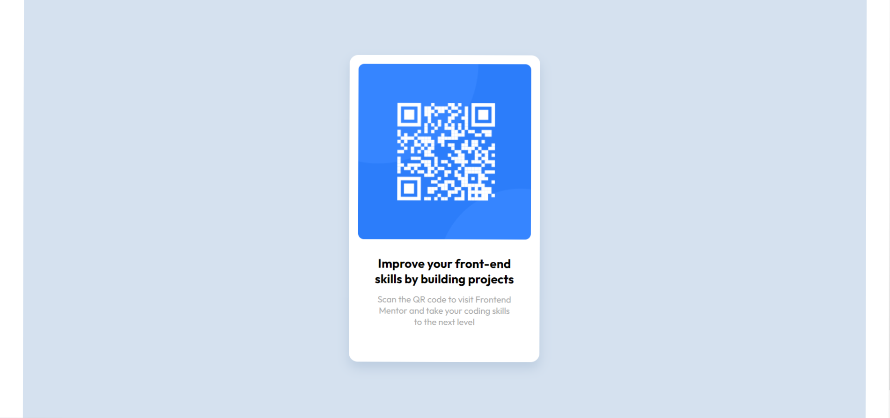

# Frontend Mentor - QR code component solution

This is a solution to the [QR code component challenge on Frontend Mentor](https://www.frontendmentor.io/challenges/qr-code-component-iux_sIO_H). Frontend Mentor challenges help you improve your coding skills by building realistic projects. 

## Table of contents

- [Overview](#overview)
  - [Screenshot](#screenshot)
  - [Links](#links)
- [My process](#my-process)
  - [Built with](#built-with)
  - [What I learned](#what-i-learned)
- [Author](#author)


## Overview

### Captura de tela - Versão Desktop




### Links

- Solution URL: [Add solution URL here](https://github.com/Ymacedo05/qr-code-component-main)
- Live Site URL: [Add live site URL here](http://127.0.0.1:5500/Projetos_Front/frontend_mentor/qr-code-component-main/index.html)

## My process

### Built with [Construido com]

- Marcação semântica HTML5
- Propriedades personalizadas de CSS
- Flexbox


### What I learned [O que eu aprendi]

É possivel acrescentar uma largura e altura íniciais e determinar o quanto o layout será flexivel acrescentando max e min.


```css
#cont{
      width: 1440px;
      min-width: 375px;
      height: 800px;
      min-height: 667px;
    }
```

## Author

- Website - [YM](https://github.com/Ymacedo05)
- Frontend Mentor - [@yourusername](https://www.frontendmentor.io/profile/yourusername)
- Twitter - [@yourusername](https://www.twitter.com/yourusername)


